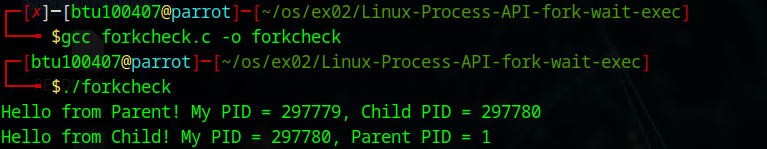
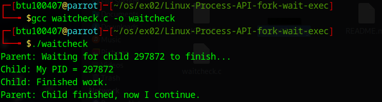
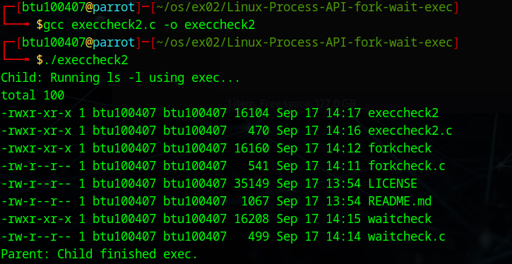

# Linux-Process-API-fork-wait-exec-
Ex02-Linux Process API-fork(), wait(), exec()
# Ex02-OS-Linux-Process API - fork(), wait(), exec()
Operating systems Lab exercise

# AIM:
To write C Program that uses Linux Process API - fork(), wait(), exec()

# DESIGN STEPS:

### Step 1:

Navigate to any Linux environment installed on the system or installed inside a virtual environment like virtual box/vmware or online linux JSLinux (https://bellard.org/jslinux/vm.html?url=alpine-x86.cfg&mem=192) or docker.

### Step 2:

Write the C Program using Linux Process API - fork(), wait(), exec()

### Step 3:

Test the C Program for the desired output. 

# PROGRAM:

## C Program to create new process using Linux API system calls fork() and getpid() , getppid() and to print process ID and parent Process ID using Linux API system calls

    #include <stdio.h>
    #include <unistd.h>

    int main() {
    pid_t pid;

    pid = fork();  // create a new process

    if (pid < 0) {
        printf("Fork failed!\n");
    }
    else if (pid == 0) {
        // child process
        printf("Hello from Child! My PID = %d, Parent PID = %d\n", getpid(), getppid());
    }
    else {
        // parent process
        printf("Hello from Parent! My PID = %d, Child PID = %d\n", getpid(), pid);
    }

    return 0;
    }

##OUTPUT

## C Program to execute Linux system commands using Linux API system calls exec() , exit() , wait() family
## waitcheck
    #include <stdio.h>
    #include <unistd.h>
    #include <sys/wait.h>

    int main() {
    pid_t pid;

    pid = fork();

    if (pid == 0) {
        // child process
        printf("Child: My PID = %d\n", getpid());
        sleep(2);
        printf("Child: Finished work.\n");
    }
    else {
        // parent process
        printf("Parent: Waiting for child %d to finish...\n", pid);
        wait(NULL);  // parent waits
        printf("Parent: Child finished, now I continue.\n");
    }

    return 0;
    }

## OUTPUT

# RESULT:
The programs are executed successfully.
